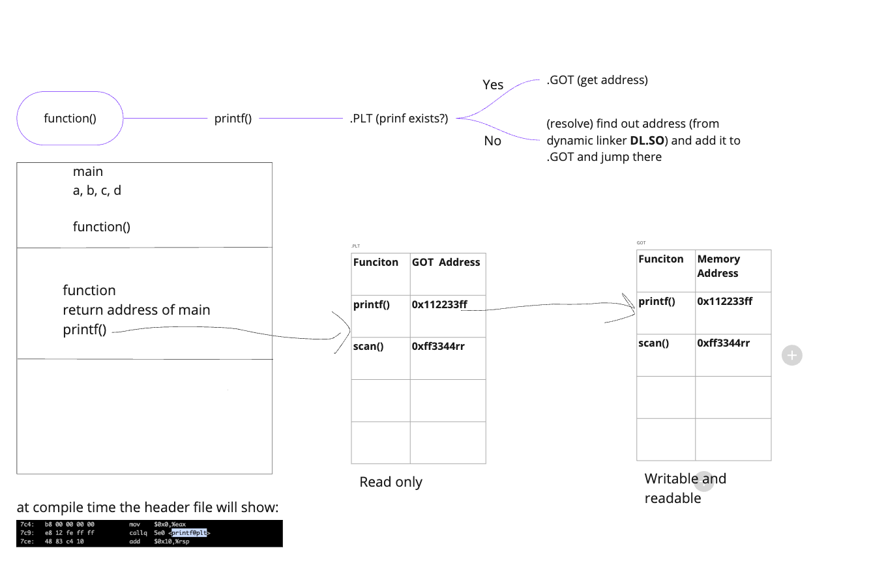

# Stack canaries
Stack-based canaries provide protection agaist manipulation of the return address saved on the stack (NOP slecds technique)
A stack canary is a value placed on the stack so that it will be overwritten by a stack buffer that
overflows to the return address. It allows detection of overflows by verifying the integrity of the
canary before function return

# Format String Vulnerabilities can be performed on:
- function pointers - point to specific functions 
- destructors (.dtors) - can be automatically invoked when main terminates
- GOT (Global Offset Table) - is a memory region that contains several function pointers, executables, and
shared libraries

# PLT and GOT 
- sections with ELF file reponislbe for __dynamic linking__
- used to safe space and not include all libraries in the binary files
- .PLT is read only
- .GOT is writable and readable and vulnerable (attack to overwrite a GOT entry)
- all c function addresses are stored in the got table
- 

# printf
- when called program jumps from stack memory to libraary to call the function
- .GOT has addresses of all c functions
    