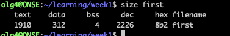

## GCC
- `gcc -g -o first MyFirst.c`- compiler (does all the linking and translating of code to something that the system can run)
- '-g' - to show debugging info after execution
- 'first' - name of the binary file
- 'MyFirst.c' - name of the c file
- '-o' - create object binary
- '-m32' - binary file to be in 32 bits format

## GDB
`gdb <binary_filename` - will open the program in the debugger mode
`list` - shows the code of the program and line numbers (useful for setting breakpoints)
    - by default, it shows 10 lines, user `show listsize`
    - to change use `set listsize <size>`
`break` - to add a break 
`delete 1` - to delete breakpoint 1
`clear` - to clear all breakpoints
`print <var name>` - to print variable value
`run` - to run the program (if it needs input profile it: run olga)
`continue` - for the program to continue after the break
`step` - to move to next line
`disas <funcion_name>` - to see the assembly code of a function 
`info reg` - shows the content of registers 
`print $<reg>` - see value in the register
`print/x $reg` - see the hexadecimal value of the register

- Memory
    - `backtrace` - how many stack frames are generated in that stack memory
    - `i r` - shows what are register values 
    - `info frame` 
    - `x/100x $esp-200` - display memory from the stack starting from sp-200
    - `x/s <reg value>` - see what in the specific register 
    - `x/10x $esp`: prints the 10 characters after the stack pointer
	- `x/10i $eip`: prints the 10 instructions after the instruction pointer
	- `x/16x 0x804997c`: prints 16 words at the specific address.
	    - f=x print as hexadecimal; f=d print as decimal; f=a print as address
	- `x/nfu <addr>` examine memory
	    - n repeat count, f format (similar to print), u unit size.

(GDB Cheat Sheet)[https://gist.github.com/rkubik/b96c23bd8ed58333de37f2b8cd052c30]

## Memory layout
`readelf -h <binary_filename>` -show info about header section 
`readelf -S <binary_filename>` - show the memory layout 

## Size 
 `size <binary_filename>` - shows size by segment 
 

 # File commands
 `file <objname>` - information about the executable file in Linux
    - `h` display header information 

# Readelf command
`readelf <objname>`
    - `h` for header 
    - `a` all information 

# Objecdum
- investigate the environment of the file, assembly etc. use man objdump to see more 
- `objdump <objname>` (to learn about the environment of the file)
- `objdump <objname>` -f file - generates a summary of the file
- `objdump <objname>` -h file - will show all sections for the file 
- `objdump <objname>` -d file - will show assembly instructions
